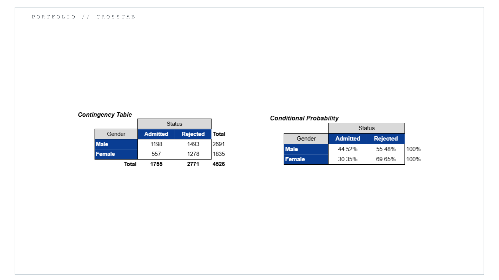
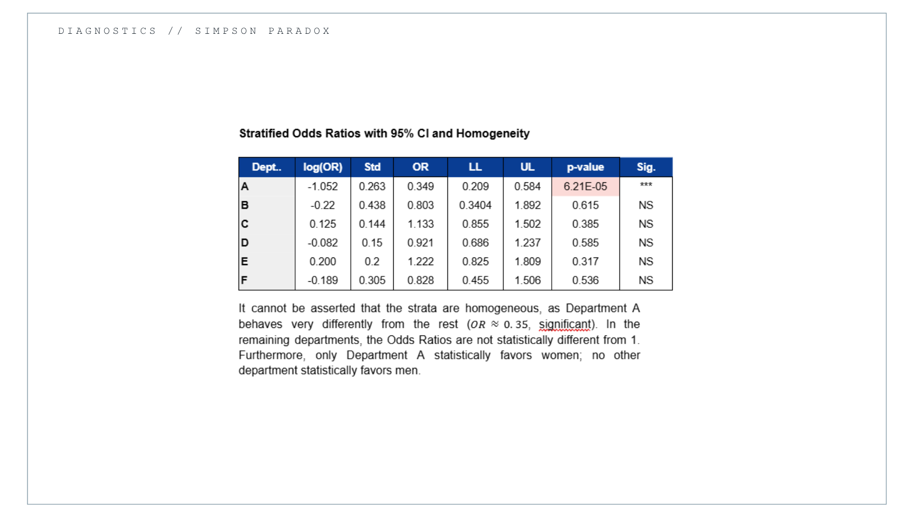
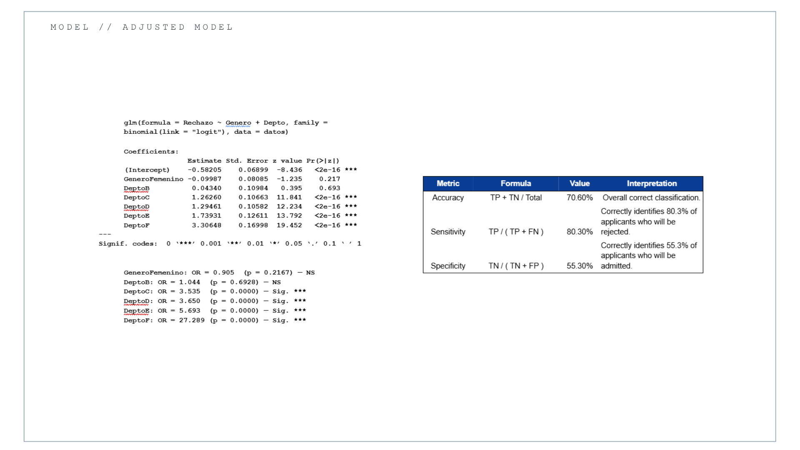

# Categorical Data Analysis & Logistic Regression
### A Case Study of the Berkeley Graduate Admissions Dataset (1973)

This project presents a comprehensive categorical data analysis of the **Berkeley Graduate Admissions (1973)** dataset. The analysis combines contingency tables, Odds Ratios, Mantel–Haenszel estimation, Simpson's Paradox, and logistic regression models to investigate the apparent association between gender and admission decisions.

---

# Overview

The Berkeley admissions dataset is one of the most well-known examples of **Simpson's Paradox** in statistics.

This project reproduces the complete statistical analysis starting from contingency tables and hypothesis testing, continuing with stratified analysis using the Mantel–Haenszel estimator, and concluding with logistic regression models in R.

The objective is not only to estimate the association between gender and admission outcomes but also to demonstrate how confounding variables can completely reverse an observed relationship.

---

# Objectives

- Perform exploratory analysis using contingency tables.
- Compute Odds Ratios manually in Microsoft Excel.
- Estimate confidence intervals for Odds Ratios.
- Apply Mantel–Haenszel adjustment.
- Evaluate the presence of Simpson's Paradox.
- Build logistic regression models in R.
- Compare nested logistic regression models.
- Evaluate model performance using classification metrics.

---

# Methodology

The project was divided into two complementary stages.

### Stage 1 – Statistical Analysis (Microsoft Excel)

- Contingency tables
- Marginal and conditional probabilities
- Chi-square test of independence
- Standardized residuals
- Odds Ratios
- Confidence intervals
- Mantel–Haenszel Odds Ratio
- Simpson's Paradox

### Stage 2 – Logistic Regression (R)

- Simple logistic regression
- Multiple logistic regression
- Interaction models
- Likelihood Ratio Tests
- Model comparison using AIC
- Confidence intervals for Odds Ratios
- ROC analysis
- Confusion Matrix
- Classification metrics

---

# Technologies

- R
- Microsoft Excel
- Logistic Regression
- Generalized Linear Models (GLM)
- Maximum Likelihood Estimation

---

# Statistical Methods

This project includes:

- Contingency Tables
- Odds Ratios (OR)
- Confidence Intervals
- Mantel–Haenszel Estimator
- Chi-square Test
- Standardized Residuals
- Logistic Regression
- Likelihood Ratio Test
- Model Selection (AIC)
- ROC Curve
- Confusion Matrix
- Accuracy
- Sensitivity
- Specificity

---

# Key Findings

The analysis shows that:

- The crude Odds Ratio suggests an apparent disadvantage for female applicants.
- After stratifying by department, the association changes substantially.
- The Mantel–Haenszel adjusted Odds Ratio is close to one, indicating that the apparent association is explained by department-level confounding.
- Logistic regression confirms that department is the primary explanatory variable.
- The Berkeley dataset represents a classical example of Simpson's Paradox in applied statistics.

---

# Results

## Contingency Analysis

---

## Simpson's Paradox

---

## Logistic Regression & Performance

---

# Report

The complete statistical analysis and interpretation are available in:

📄 **report/Berkeley_categorical_analysis_report_ES.pdf**

---